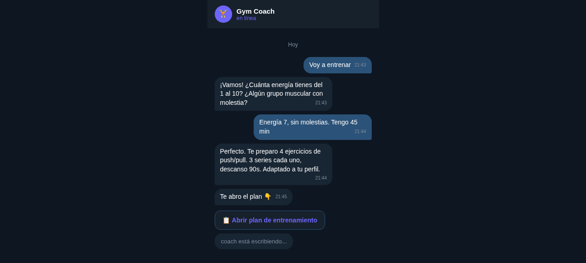
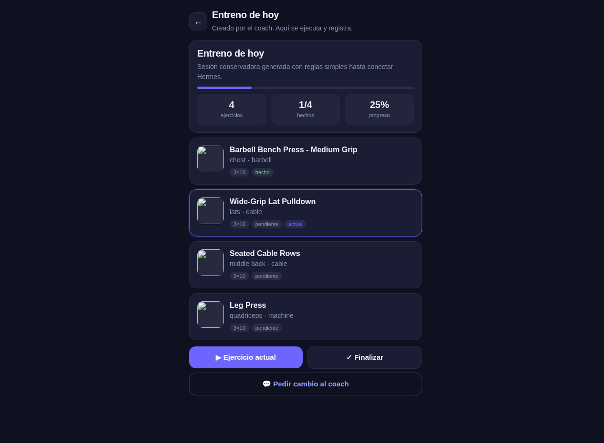
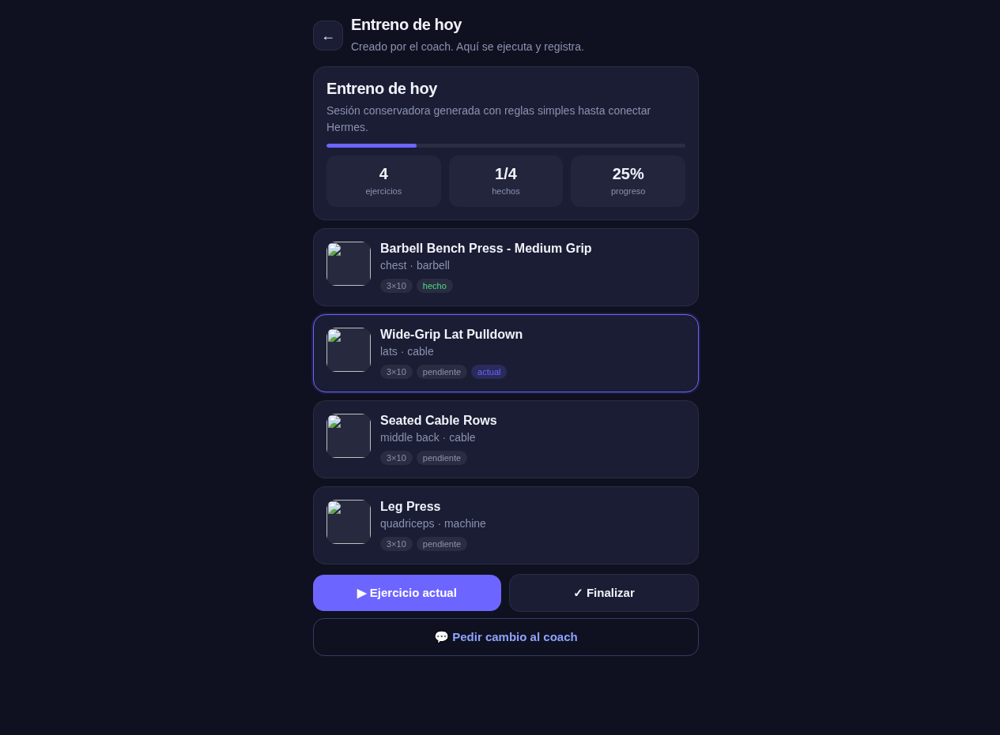

# 🏋️ Gym Coach — Tu entrenador personal en Telegram

> Conecta un coach de IA a tu Telegram. Él te pregunta, conoce tu cuerpo, crea tus entrenos y te los abre en una Mini App visual. Tú solo entrenas.

---

## ¿Qué es?

Gym Coach es un **agente entrenador** que vive en tu Telegram. No es una app más de gimnasio — es un coach real que:

- **Te conoce**: pregunta tu objetivo, experiencia, lesiones, equipamiento del gym
- **Crea planes adaptados**: cada entreno es único, basado en tu perfil y energía del día
- **Te guía en tiempo real**: te dice qué ejercicio toca, qué serie, qué peso
- **Se adapta**: ¿una máquina está ocupada? ¿te duele algo? Lo cambia al instante
- **Registra todo**: series, pesos, sensaciones — sin que tú toques nada
- **Aprende**: guarda tus preferencias y evita lo que odias

Y cuando necesitas ver el plan o registrar series tocando botones, te abre una **Mini App visual** dentro de Telegram.

---

## Cómo se ve

### El chat con el coach


### La Mini App — plan del día


### La Mini App — registrar series


---

## ¿Por qué esto es diferente?

Las apps de gimnasio te dan una plantilla y te dejan solo. Gym Coach es un **agente** que conversa contigo:

- *— Voy a entrenar*
- *— ¿Cuánta energía tienes? ¿Molestias?*
- *— Energía 7, sin molestias, 45 minutos*
- *— Perfecto. 4 ejercicios, 3 series. Te lo abro 👇*

No rellenas formularios. No buscas ejercicios. **Hablás con tu coach y él hace todo.**

---

## Arquitectura — pensada para agentes

```text
Tú ──Telegram──> Coach (Hermes) ──MCP──> API ──> Base de datos
                        │
                        └──deep link──> Mini App (visual)
```

La aplicación es **agnóstica al agente**. No sabe ni le importa quién la llama. Todo se controla via MCP (18 herramientas):

| Categoría | Qué hace el agente |
|---|---|
| **Perfil** | Leer y actualizar tu perfil deportivo |
| **Catálogo** | Buscar ejercicios, ver alternativas |
| **Sesiones** | Crear planes, ver estado actual, registrar series |
| **Mini App** | Generar deep links para abrir la web |

Cualquier agente con soporte MCP (Hermes, Claude, Cursor...) puede controlar la app entera.

---

## Setup rápido

### Opción A: Docker Compose (local, 5 minutos)

```bash
git clone https://github.com/jlfernandezfernandez/gym-tracker.git
cd gym-tracker

# Configurar
cp .env.example .env
# Edita .env: pon tu TELEGRAM_BOT_TOKEN (de @BotFather)

# Levantar
docker compose up -d

# La app está en http://localhost:8000
```

### Opción B: Coolify (producción con dominio)

1. Fork/clone este repo
2. En Coolify: New Resource → GitHub → selecciona `gym-tracker`
3. Añade un Postgres como servicio vinculado
4. Set environment variables:
   - `TELEGRAM_BOT_TOKEN` = tu token de @BotFather
   - `CORS_ORIGINS` = tu dominio (ej: `https://gym.midominio.com`)
5. Deploy

El Dockerfile es multi-stage: compila el frontend con Astro y sirve todo desde un solo contenedor.

### Conectar el coach (Hermes)

Después de levantar la app, conecta un perfil de Hermes como coach:

```bash
# Crear perfil separado para el coach
hermes profile create gym-coach

# Registrar el MCP
hermes -p gym-coach mcp add gym_tracker \
  --stdio /path/to/gym_tracker_mcp.py \
  --env GYM_TRACKER_API_BASE=https://gym.midominio.com/api \
  --env GYM_TRACKER_APP_BASE=https://gym.midominio.com

# Configurar el bot de Telegram
hermes -p gym-coach config set telegram.bot_token "TU_BOT_TOKEN"

# Iniciar el gateway
hermes -p gym-coach gateway start
```

El coach tiene su propia personalidad y skill. Copia los templates de `templates/SOUL.md` y `templates/SKILL.md` al perfil.

Lee [`docs/coach-setup.md`](docs/coach-setup.md) para la guía completa paso a paso.

---

## Multi-usuario

Cada persona que abre la Mini App desde Telegram se identifica automáticamente via **Telegram InitData** (firma HMAC con el bot token). No hay registros, no hay passwords.

- **Tus sesiones son tuyas**: nadie más puede verlas o modificarlas
- **Tu perfil es tuyo**: cada usuario tiene su propio perfil de atleta
- **Datos separados**: cada instancia (docker compose o Coolify) tiene su propia base de datos

Si despliegas tu propia instancia, tus datos están en tu Postgres, en tu servidor. Nadie más tiene acceso.

---

## MCP — las 18 herramientas del coach

El coach controla toda la app via MCP. Estas son las herramientas:

| Tool | Para qué |
|---|---|
| `health` | Saber si la API está viva |
| `get_athlete_profile` | Leer perfil del atleta |
| `update_athlete_profile` | Guardar perfil tras onboarding |
| `patch_athlete_profile` | Actualizar campos sueltos |
| `list_exercises` | Buscar ejercicios por nombre o músculo |
| `list_muscle_groups` | Ver grupos musculares disponibles |
| `get_session` | Ver una sesión completa |
| `get_today_session` | Ver la sesión de hoy |
| `get_active_session` | Ver sesión en curso + estado actual |
| `get_current_state` | Saber qué ejercicio y serie toca ahora |
| `create_plan` | Crear un plan de entrenamiento |
| `log_set` | Registrar una serie (peso, reps, sensación) |
| `complete_exercise` | Marcar ejercicio como completado |
| `update_planned_exercise` | Cambiar/saltar un ejercicio |
| `alternatives` | Ver alternativas de un músculo |
| `finish_session` | Terminar sesión con feedback |
| `session_web_url` | Generar link a la Mini App |
| `share_web_url` | Generar link compartible (solo lectura) |

---

## Stack

- **Backend**: FastAPI + SQLModel + Postgres
- **Frontend**: Astro (static build) → Mini App de Telegram
- **MCP**: Python (FastMCP) — el puente entre agente y app
- **Deploy**: Docker multi-stage, Coolify o docker compose
- **Auth**: Telegram InitData HMAC (sin passwords)

---

## Estructura del repo

```text
├── backend/          # FastAPI app (API + static files)
│   ├── routers/      # sessions, exercises, coach, profile
│   ├── models.py     # SQLModel tables
│   ├── schemas.py    # Pydantic schemas
│   ├── telegram_auth.py  # HMAC InitData validation
│   └── seed/         # Exercise catalog seeder
├── frontend/         # Mini App HTML (Astro wraps it)
├── mcp/              # MCP server (18 tools)
├── templates/        # SOUL.md + SKILL.md for coach profile
├── docs/             # Setup guide + screenshots
├── Dockerfile        # Multi-stage: Astro build + FastAPI
└── docker-compose.yml
```

---

## Licencia

MIT. Úsalo, modifícalo, compártelo.

---

## ¿Quién lo hizo?

Un agente Hermes construyó este producto entero: backend, frontend, MCP, Docker, despliegue. El coach que lo usa también es Hermes. Es un producto pensado para que agentes de IA controlen entrenamientos de personas reales.